# MIMO
MIMO - A Mental Health Support Bot. It can be your close friend and confidant.

## Abstract

As per NAMI(National Alliance on Mental Illness, 21% of U.S. adults experienced mental illness in 2020 (52.9 million people). This represents 1 in 5 adults. Mental Health related issues can lead to substance abuse and potentially harm to others and yourself. 
While anyone can suffer for mental illness related issues, its more common in people of color, LGBT community, children and women. Traditional methods of treating it includes thearpy and talking with friends and family. These techniques require a lot of manpower and cost. 
In comes MIMO, a mental health support bot that can act as your close friend and confidant. Its a prototype that helps you connect with medical professionals in the area, listens to you and suggest activities like Yoga, reading, going for a walk, sharing cute animal pics to mitigate the problems the user faces.

## Hill Statement

> _Who: Anyone and everyone

> _What: A self help bot to identify if the user is depressed, help them connect with medical professionals and try to help them mitigate some of the problems they face.

> _WoW Factor: The fast development options given by Rasa made development of the chatbot possible in less than 5 days with a single developer. 

## About the repo and Installation

We have structed the repo such that the entire code required to excecute the project is under the MIMO folder. The project is developed on a Windows machine so Ubuntu or Mac users may face some installation issues but its highly unlikely.
Please follow the steps below to recreate the project:

1. Copy the repo
2. Create an [new environment](https://www.jetbrains.com/help/pycharm/creating-virtual-environment.html)
3. Install the requirements.txt file. [Command](https://stackoverflow.com/questions/7225900/how-can-i-install-packages-using-pip-according-to-the-requirements-txt-file-from)
4. Now before we set up Rasa, we need to first make sure that we are able to connect with our MySQL database. Currently the project is hosted on AWS RDS and you need to place the connections.py share in the code/actions folder to ensure connection is established. The file is sent seperately via mail and is also available in Project submission but not shared in the repo for security reasons.
5. Instead of step 4, One can also create their own local database by using the [Readme.md](https://github.com/swapnilparihar14/MIMO/tree/main/mysql_details) file shared here for steps.
6. Now we can start rasa in local mode by first enabling the action server by using the command: rasa run actions
7. Then we can start Rasa-X interactive GUI by running the command in another terminal in the same environment: rasa x

If you face any installation issues please feel free to contact me at swapnilavinash.parihar@sjsu.edu

The project demo link video can be accessed [here](https://youtu.be/MjXpuRhXfPM).
## Implementation Snippets
Snippets shown below give you examples of what data should be feed to the chatbot and its expected response. It is one complete happy sequence of input data. But a lot of variations of it can happen on runtime.

#### Greet message

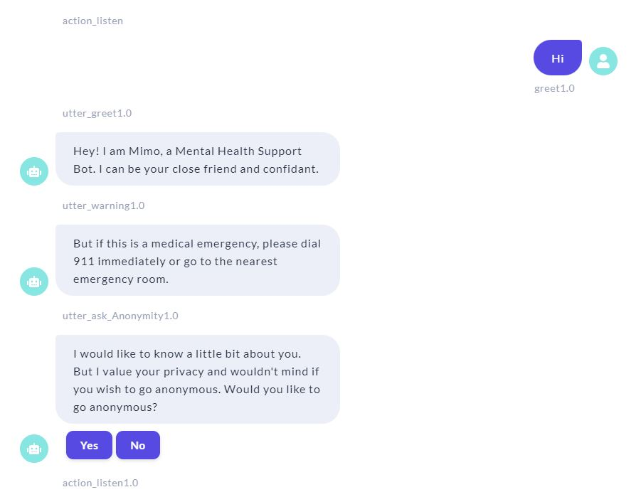

#### Ask the user for email if you dont want to be anonymous 

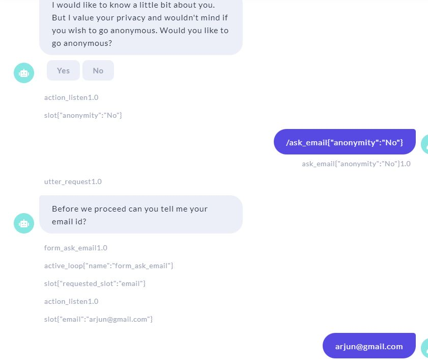

#### Ask for more user details 

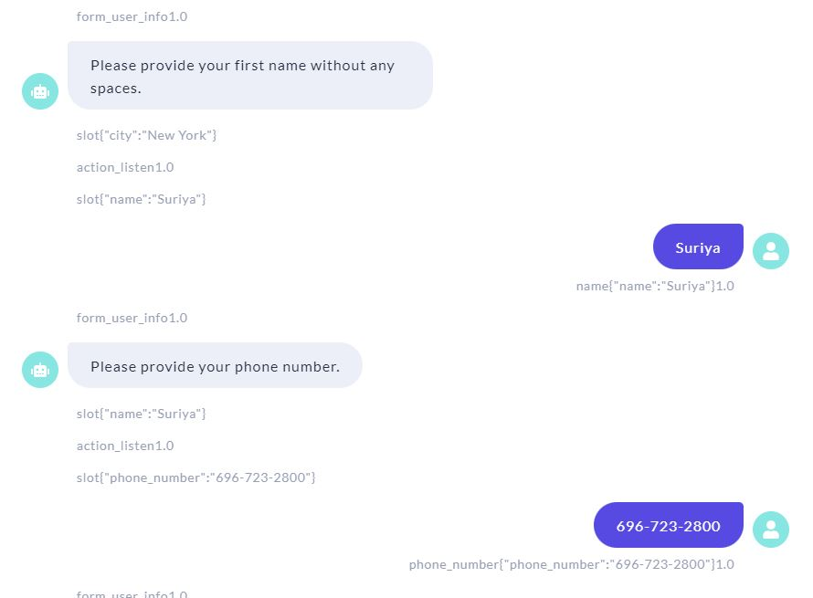

#### List of options the project can do

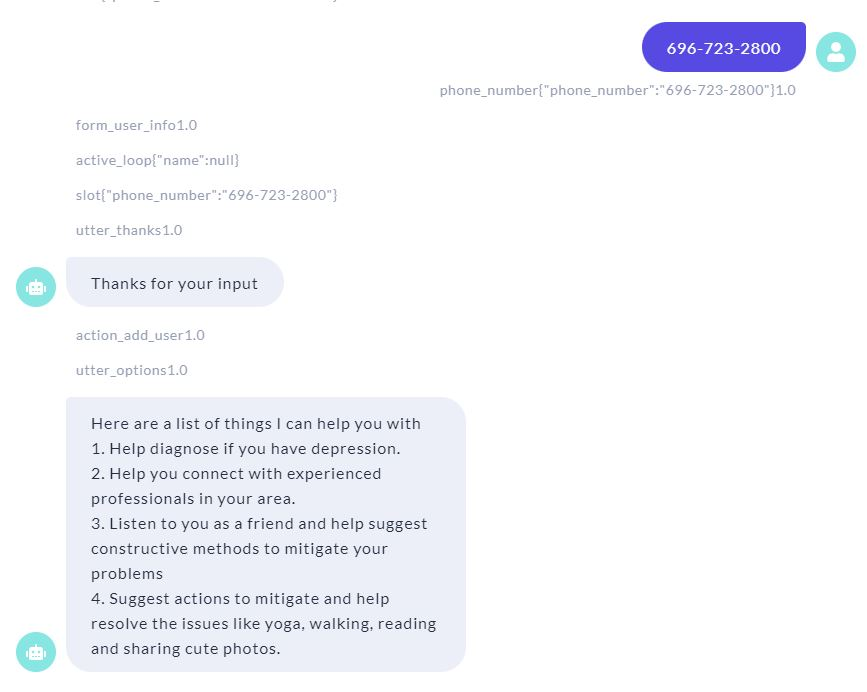

#### How the bot detects and responds to depression detection

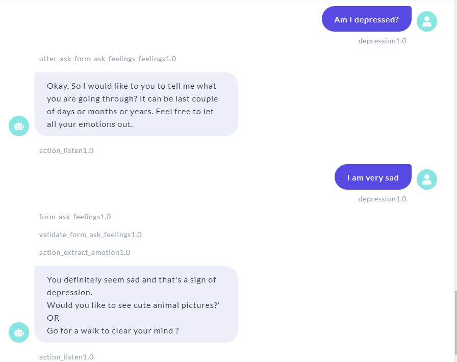

#### Bot replies with cute pics to relieve depression

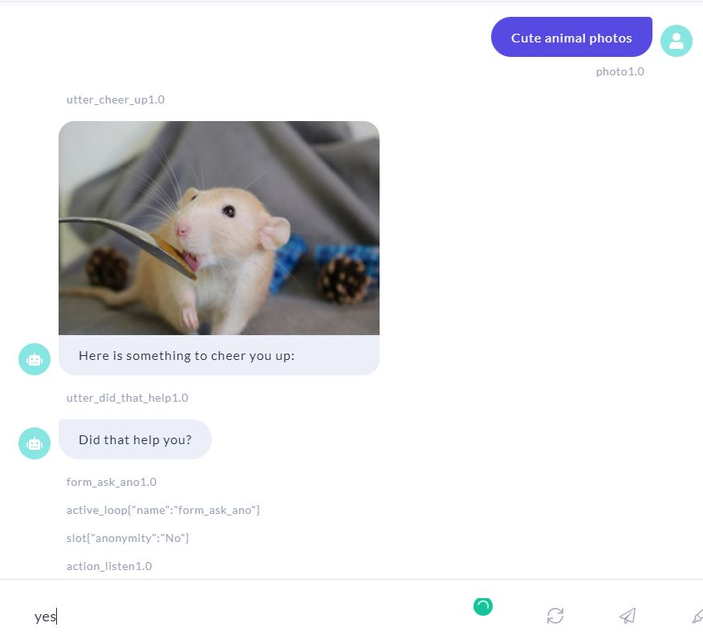

#### Bot replies with book suggestion to relieve depression

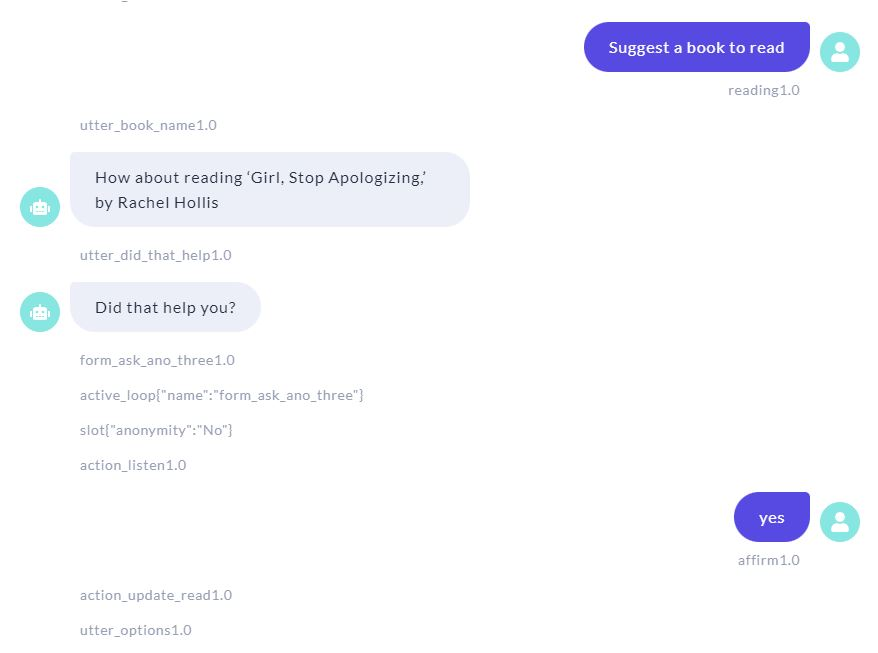

####  Bot replies with weather data to go for a walk to relieve depression

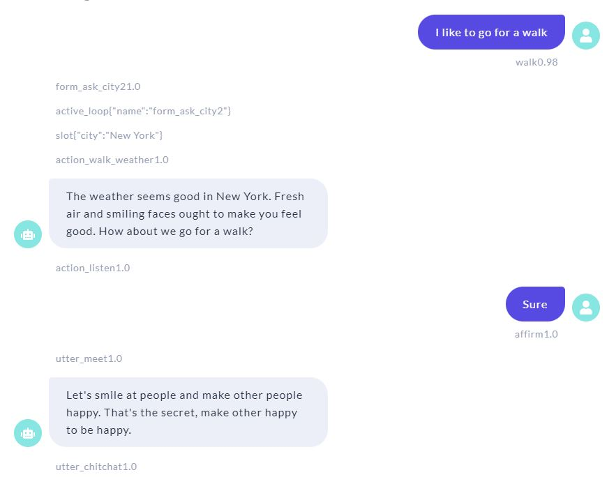

####  Bot replies with yoga video links to relieve depression

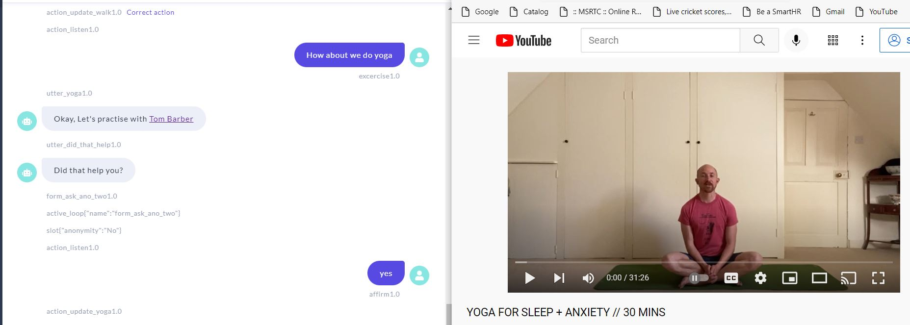

#### Bot replies with a list of doctors in your area

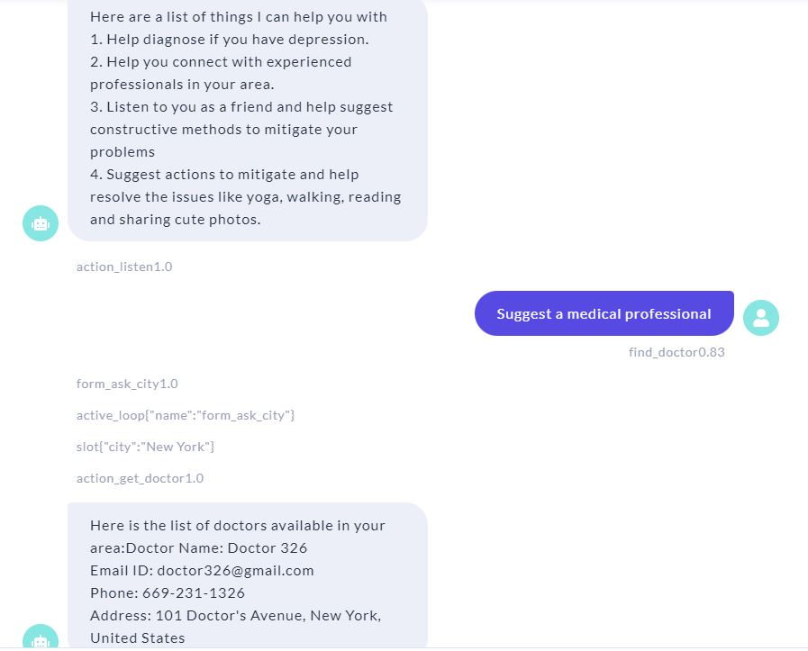

####  Bot listens to the user

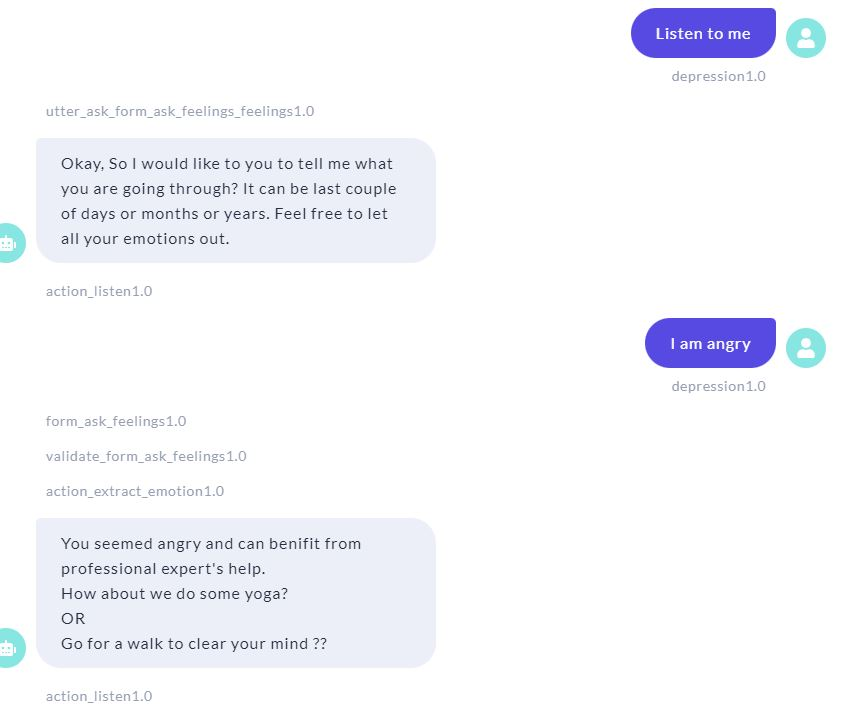

####  Tells us the score of a registered user for a particular activity

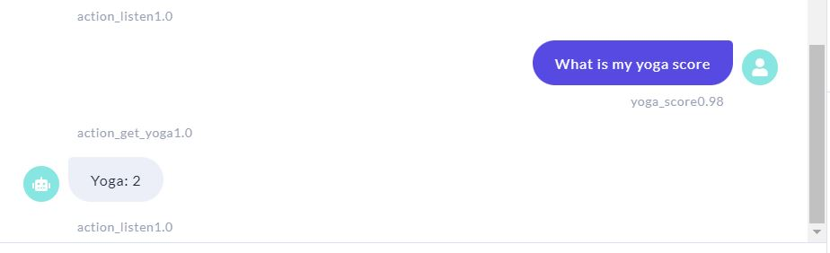

## Technology Stack

- Frontend : Rasa-X
- Machine learning : Python - Pandas, NLTK, Rasa
- Support technologies/APIs : Self developed improved version of text2emotion Python library, OpenWeather API
- Database : MySQL

## Known Exisiting Issues (Thanks to extensive testing by Madhuri and Monalisha)

- Even after ample Naming examples in the NLU file, while entrying names the user has to be a little bit verbose. Like instead of just the name "Swapnil Parihar", its more apt to use "My name is Swapnil Parihar"
- Emotion classification input requires input from the user that should not be classified in any intent. As per official documentation this can be done using FormAction validation. But I am not sure if this is because of the Windows OS or something I am missing but Rasa does not skip this classification. So the depression intent is used to loop through this and send the latest input to emotion extraction.

## Team Members

1. Swapnil Parihar (DEV)
2. Monalisha Parida (Tester)
3. Madhuri Ranvirkar (Tester)
